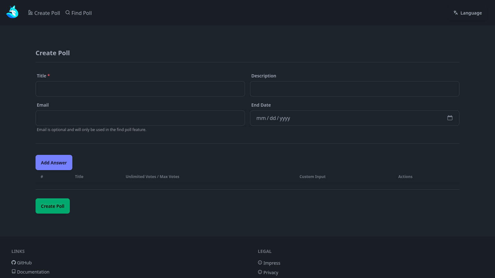
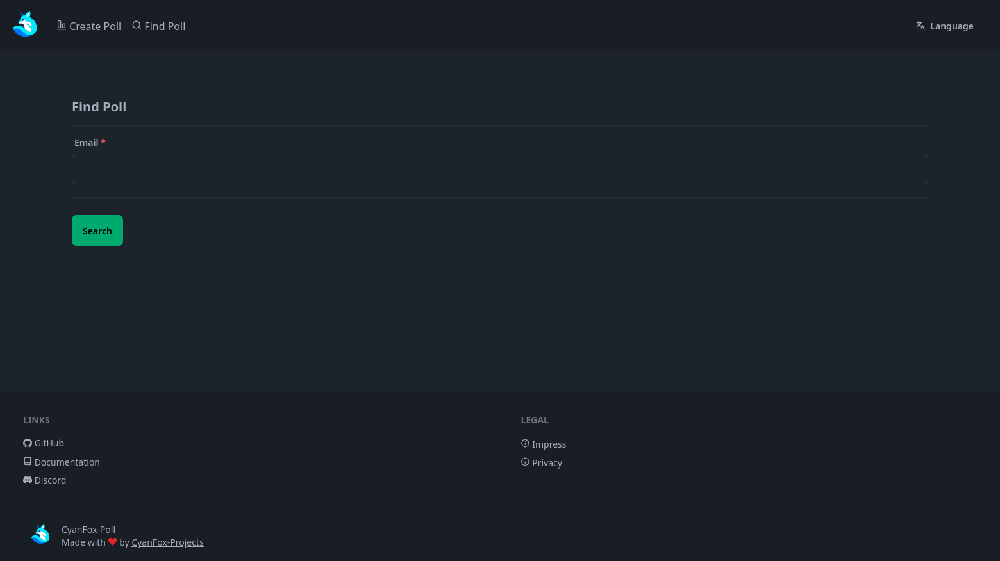
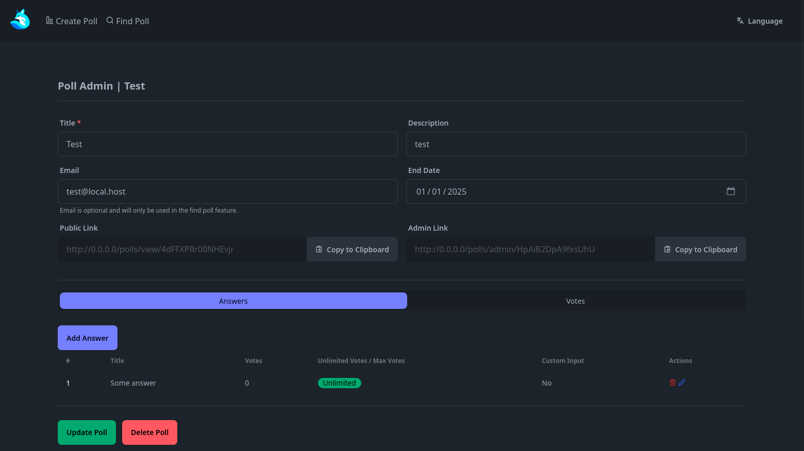
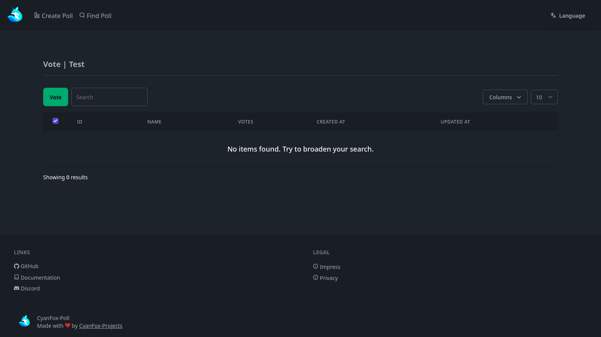

 

  

<h3 align="center">CyanFox-Poll</h3>

  

    A simple poll system.
     
    <a href="https://github.com/CyanFox-Projects/CyanFox-Poll/wiki"><strong>📖 Explore the docs »</strong></a>
     
     
    <a href="https://github.com/CyanFox-Projects/CyanFox-Poll/issues/new?labels=bug&template=bug.yml">🐛 Report Bug</a>
    ·
    <a href="https://github.com/CyanFox-Projects/CyanFox-Poll/discussions/new?category=ideas">✨ Request Feature</a>
    ·
    <a href="https://github.com/CyanFox-Projects/CyanFox-Poll/discussions/new?category=q-a">❓ Ask a question</a>
  

    
    
    
    

## Security Vulnerabilities

Please review [our security policy](SECURITY.md) on how to report security vulnerabilities.

## Contributing

Please see [CONTRIBUTING](CONTRIBUTING.md) for details.

## License

The MIT License (MIT). Please see [License File](LICENSE) for more information.

## Screenshots

Show

